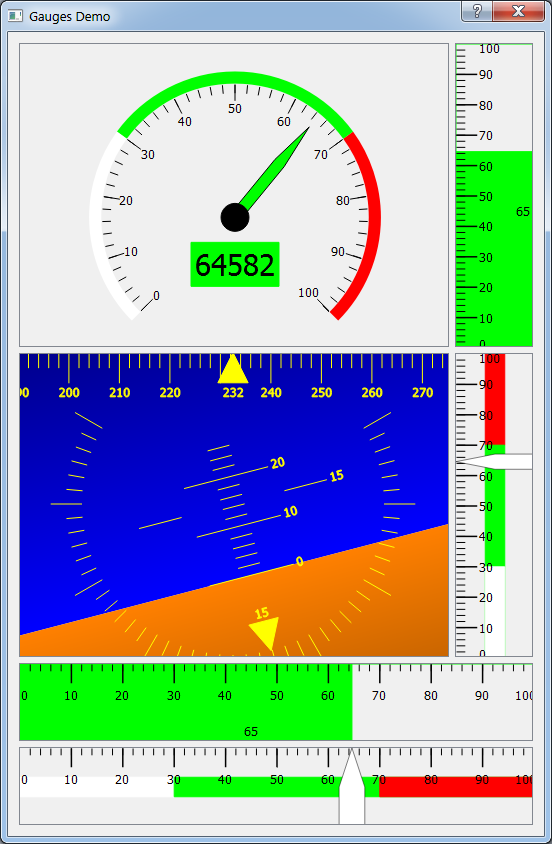

Introduction
============

Qt Gauges is a short demonstration program that serves as contain for some useful gauges created using QGraphicsScene. The gauges include:

1. A dial scene suitable for a speed display (engine RPM, airspeed, etc.).
2. An attitude scene suitable for an AHRS (attitude-heading-reference-system).
3. A horizontal or vertical linear gauge suitable for most generic measurements.
4. A second linear gauge with a different style suitable for most generic measurements.

All of the gauges have a rich API that allows you to specific alarm values and colors, text labels, tick mark labels, etc. The Gauges are most commonly built by including a QGraphicsView in your form layour, and then calling gauge->setupView(QGraphicsView*). See the Qt Gauges project for an example. Note that the graphics view can be promoted to a QGraphicsViewNoScroll to progrmatically prevent the graphics view from scrolling in response to user mouse events.

Source code for Qt Gauges is available on [github](https://github.com/billvaglienti/QtGauges).

---

About the author
===========================

Contact information:

Bill Vaglienti

Five by Five Development, LLC

[www.fivebyfivedevelopment.com](http://www.fivebyfivedevelopment.com)
